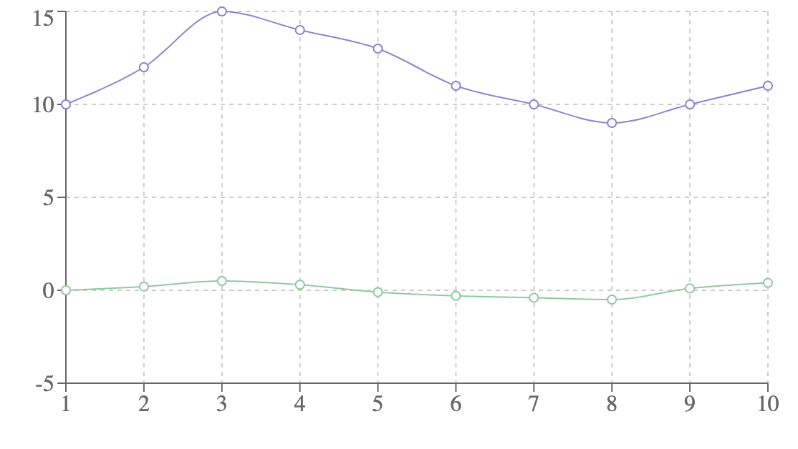

# Squeeze_Alert

## Описание проекта

Данный проект представляет собой инструмент для анализа финансовых рядов с использованием индикатора "Squeeze" (сжатия).

### Возможности

- Расчет индикатора сжатия на основе Bollinger Bands и Keltner Channels
- Визуализация финансовых данных
- Интерактивный веб-интерфейс для отображения результатов

### Технологии

- Golang (Backend)
- React (Frontend)
- Recharts (Визуализация)

### Запуск сервиса

Запуск сервиса:
   ```
   go run main.go
   ```
### Запуск тестов

Запуск тестов:
   ```
    go test ./indicator/
   ```


### Индикатор Squeeze

Индикатор сжатия помогает определить периоды низкой волатильности перед значительным движением цены:
- Желтые точки: Period of Squeeze (сжатие)
- Зеленые точки: Normal volatility (нормальная волатильность)

### Параметры расчета

- Длина периода: 20
- Множитель Bollinger Bands: 2.0
- Множитель Keltner Channels: 1.5

### Визуализация индикатора Squeeze

Ниже приведен пример визуализации индикатора Squeeze:


